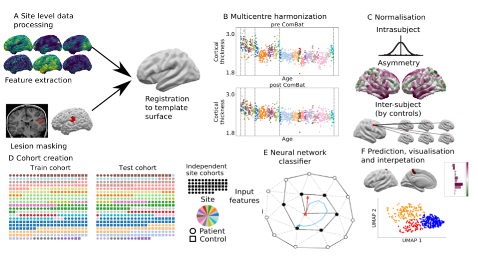

# MELD FCD 
Graph based FCD lesion segmentation for the MELD project.

*Code Authors : Hannah Spitzer, Mathilde Ripart, Sophie Adler, Konrad Wagstyl*

## Notes

This package comes with two pretrained models that can be used to predict FCD-lesions from MRI scans (with or without harmonising the data beforehand). \
It also contains code for training and evaluating graph-based U-net lesion segmentation models operating on icosphere meshes. \
In addition to lesion segmentation, the models also contain auxiliary distance regression and hemisphere classification losses.

For more information check our manuscripts: 
- the manuscript describing the [original MELD FCD pipeline and dataset](https://academic.oup.com/brain/advance-article/doi/10.1093/brain/awac224/6659752)
- the manuscript describing the [updated graph-based model](https://arxiv.org/abs/2306.01375)

## Disclaimer

The MELD surface-based graph FCD detection algorithm is intended for research purposes only and has not been reviewed or approved by the Medicines and Healthcare products Regulatory Agency (MHRA), European Medicine Agency (EMA) or by any other agency. Any clinical application of the software is at the sole risk of the party engaged in such application. There is no warranty of any kind that the software will produce useful results in any way. Use of the software is at the recipient's own risk.

## Installation & Use of the MELD FCD prediction pipeline

### Installations available 
You can install and use the MELD FCD prediction pipeline with :
- [**docker container (recommended).**](/documentation/Run_with_docker.md) This method is recommended for easy installation and use of the pipeline as all the prerequisite packages are already embeded into the container. Note: Dockers are not working on High Performance Computing (HCP) systems.
- [**native installation.**](/documentation/Run_with_native.md) This method is recommended for more advance users that would like to be able to modify the codes and/or use the code to train/test their own classifier. 
- **singularity container (COMING SOON)**: This method is not yet available but will enable to run a container on High Performance Computing (HCP) systems. 

### Running the pipeline 
Once installed you will be able to use the MELD FCD prediction pipeline on your data following the steps:
1. Prepare your data : [guidelines](/docs/prepare_data.md)
2. (OPTIONAL) Compute the harmonisation parameters : [guidelines](/docs/harmonisation.md)
3. Run the prediction pipeline: [guidelines](/docs/run_prediction_pipeline.md)

**What is the harmonisation process ?**

Scanners can induce a bias in the MRI data. The MELD pipeline offers the possibility to adjust for these scanners differences by running a preliminary harmonisation step to compute the harmonisation parameters for that specific scanner. Note: this step needs to be run only once, and requires data from at least 20 subjects acquired on the same scanner and demographic information (e.g age and sex). See [harmonisation instructions](/documentation/Harmonisation.md) for more details. 

Note: The MELD pipeline can also be run without harmonisation. 

## Other guidelines
With the [native installation of the MELD classifier](/documentation/Run_with_docker.md) you can reproduce the figures from our paper and train/evaluate your own models.
For more details, check out the guides linked below:
- [Notebooks to reproduce figures](/documentation/figure_notebooks.md)
- [Train and evaluate models](/documentation/Training_and_evaluating_models.md)

## Contribute
If you'd like to contribute to this code base, have a look at our [contribution guide](/documentation/CONTRIBUTING.md)

## Acknowledgments

We would like to thank the [MELD consortium](https://meldproject.github.io//docs/collaborator_list.pdf) for providing the data to train this classifier and their expertise to build this pipeline.\
We would like to thank [Lennart Walger](https://github.com/1-w) and [Andrew Chen](https://github.com/andy1764), for their help testing and improving the MELD pipeline to v1.1.0
