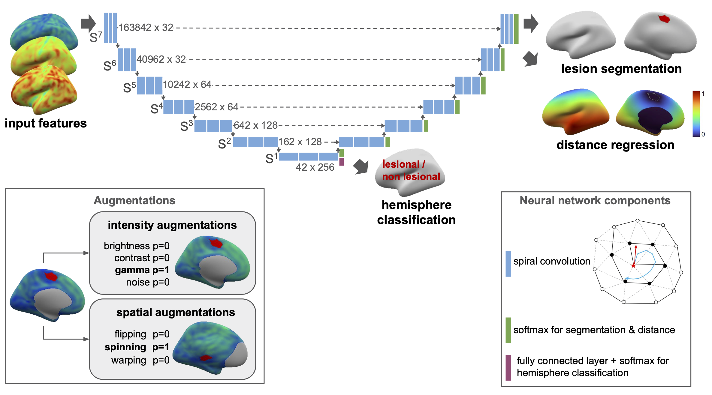

# MELD Graph
Graph based lesion segmentation for the MELD project.

This package contains code for training and evaluating graph-based U-net lesion segmentation models operating on icosphere meshes. In addition to lesion segmentation, the models also contain auxiliary distance regression and hemisphere classification losses. For more information see our [preprint](LINK).

*Authors (alphabetical): Sophie Adler, Mathilde Ripart, Hannah Spitzer, Konrad Wagstyl*



## Installation

This package requires pytorch, pytorch_geometric, [meld_classifier](https://github.com/MELDProject/meld_classifier).

Basic installation steps are:
- create the `meld_graph` environment using `environment.yml`: 
    ```
    conda env create -f environment.yml
    conda activate meld_graph
    ```
- install `pytorch_geometric` (concrete command might differ depending on your OS and CUDA):
    ```
    conda install pyg -c pyg
    ```
- donwload and install `meld_classifier`: Follow instructions [here](https://github.com/MELDProject/meld_classifier)
- install `meld_graph`: 
    ```
    git clone https://github.com/mathrip/meld_classifier_GDL.git
    cd meld_classifier_GDL
    pip install -e .
    ```
- register your EXPERIMENT_PATH in `meld_graph/paths.py`

More installation hints, including how to install on HPC and Macs, can be found [here](install.md)

## Usage
Basic commands to train and evaluate models are described below. For more details on the structure of the code and on configuration options, have a look at the [code structure guide](code_structure.md) and at the [example_experiment_config.py](scripts/config_files/example_experiment_config.py)

### Prepare files
Before training, we need to prepare scaling (for z-scoring) and augmentation parameters and downscaled icospheres.
These scripts only need to be run once, and will save parameter files in the `data` folder. A copy of the files we use is provided with this code. To reproduce these files, run:
- `prepare/create_scaling_parameters.py`: calculates scaling params file.
- `prepare/create_icospheres.py`: creates downsampled icospheres.
- `prepare/calculate_feature_means_stds.py`: TODO
- `prepare/save_xx_parameters_icospheres/nearest.py`: save precomputed augmentations - TODO

### Training
To train a single model, run
```
python train.py --config_file CONFIG_FILE
```

We can also train multiple models at once using a special config listing all config elements that should change over the runs. An example of this variable config can be found in `config_files/fold_var.py`.

Structure of this file:
- `base_name`: base name of the models. Used for experiment names and names of config files
- `parallel`: list of configs that should be run in parallel. Each entry of a list should be a dictionary with keys 'network_parameters' and 'data_parameters'. NOTE that if you change an element of a dictionary, this does NOT delete the other elements of this dictionary. Eg, if the base config contains multiple losses, changing one loss in the var config does not delete the other losses.
- `sequential`: list of configs that should be run sequentially. These models will be finetuned from each the best model of the previous entry in the sequential list. For every parallel model, all sequential models will be run. 

How to run multiple models:
```
# create all configs and save them to DIR
python create_config.py BASE_CONFIG VAR_CONFIG --save_dir DIR
# start training for all configs, with sequential models in sequence and parallel models in parallel
sbatch train_multiple.sh DIR
```

### Evaluation

**Cross validation experiments**

For establishing the best hyperparameters, we use cross-validation. 
```
python cross_val_aucs.py --experiment_path PATH_TO_EXPERIMENT --split val
```
This calculates and saves aucs for each fold in the experiment. 
The notebook [auc_comparisons.ipynb](notebooks/auc_comparisons.ipynb) can be used to compare these aucs for multiple models.
The notebook [compare_experiments.ipynb](notebooks/compare_experiments.ipynb) can be used for a quick check of model training curves for individual folds and per-vertex aucs (as opposed to subject-level sensitivity+specificity aucs) on the val sets.

**Testing experiments**
```
python cross_val_aucs.py --experiment_path PATH_TO_EXPERIMENT --split test
```
This runs on the test set and saves out the predictions for the test set for each of the folds. These then need to be ensembled and thresholded to compare experiments. 

**Ensemble final model**
To compare final performance of ensemble models, update the model paths in `ensemble.py` script and run 
```
python ensemble.py
```
This will produce a table of ensembled results on the model and a bootstrapped ensemble model for statsitics. The data tables and figures can be found in data/ and imgs/ inside the experiment folder.

## Manuscript
Please check out our [manuscript](TODO) to learn more. 
An overview of the notebooks that we used to create the figures can be found [here](figure_notebooks.md).
