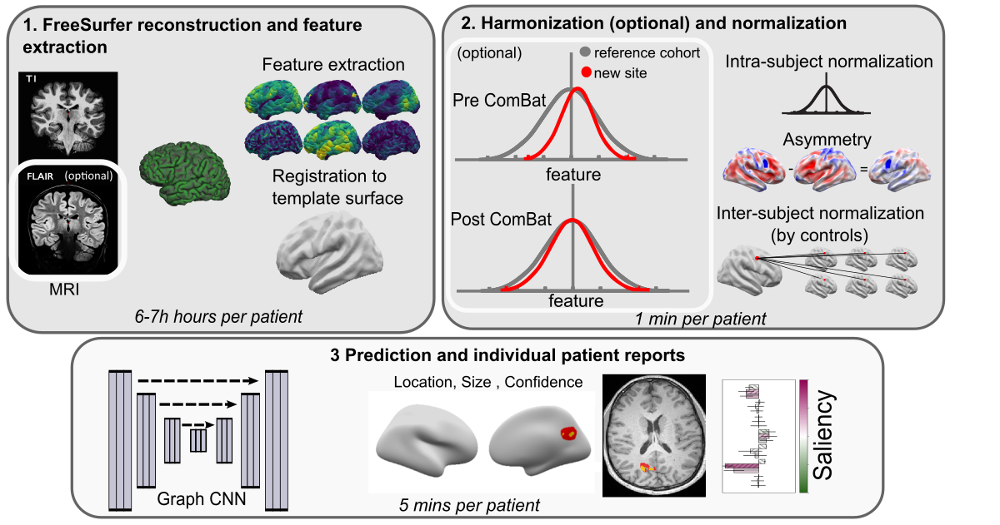

# Predict FCD-lesion on MRI data

The new MELD pipeline offers a unique command line to predict a FCD-like abnormalities from T1w (and FLAIR scan). 

If you wish to use the harmonisation feature of the MELD pipeline, you will need to first have computed the harmonisation parameters for the scanner used to acquire the data and used the harmonisation code into the main pipeline command as described bellow. Please refer to our [guidelines to harmonise a new scanner](/docs/harmonisation.md). 

## Before running

- Ensure you have installed the MELD pipeline with [docker container](/docs/install_docker.md) or [native installation](/docs/install_native.md). 
- Ensure you have [organised your data](/docs/prepare_data.md) before running this pipeline
- Ensure you have [computed the harmonisation parameters](/docs/harmonisation.md) if you want to use the harmonisation parameters 

## Run with Docker 

When running with Docker container, you just need to run the following command

```bash
docker run -it \
    --rm --gpus all --user "$(id -u):$(id -g)" \
    -v <path_to_meld_data>:/data \
    -v <path_to_freesurfer_license>:/license.txt:ro \
    -e FS_LICENSE='/license.txt' \
    meld_graph new_pt_pipeline.py -id <subject_id> 
```
With <path_to_meld_data> being the path to where your meld data folder is stored, and <path_to_freesurfer_license> the path to where you have stored the license.txt from Freesurfer. See [installation](/docs/install_docker.md) for more details

The first 5th lines are arguments describing the docker. The last line is calling the MELD pipeline command. You can tune this command using the variables and flag describes further bellow. 

## Run with native installation

When running with native installation, you will need to first ensure the following:
- 1. You have activate the meld_graph environment : 
```bash
conda activate meld_graph
```
- 2. Freesurfer is activated in your terminal (you should have some printed FREESURFER paths when opening the terminal). Otherwise you will need to manually activate Freesurfer on each new terminal by running : 
```bash
export FREESURFER_HOME=<freesurfer_installation_directory>/freesurfer
source $FREESURFER_HOME/SetUpFreeSurfer.sh
```
with `<freesurfer_installation_directory>` being the path to where your Freesurfer has been installed.

NOTES: MELD pipeline has only been tested and validated on Freesurfer up to V7.2. Please do not use higher version than V7.2.0 \

**Main pipeline command**
```bash
python scripts/new_patient_pipeline/new_pt_pipeline.py -harmo_code <harmo_code> -id <subject_id> 
```
You can tune this command using the variables and flag describes further bellow. 

## Tune the command

You can tune the MELD pipeline command using additional variables and flags as detailed bellow:

| **Mandatory variables**         |  Comment | 
|-------|---|
|either ```-id <subject_id>```  |  if you want to run the pipeline on 1 single subject. Needs to be in MELD format MELD\_<harmo\_code>\_<scanner\_field>\_FCD\_000X |  
|or ```-ids <subjects_list>``` |  if you want to run the pipeline on more than 1 subject, you can pass the name of a text file containing the list of subjects. An example 'subjects_list.txt' is provided in the <meld_data_folder>. | 
| **Optional variables** |
| ```-harmo_code <harmo_code>```  | provide the harmonisation code if you want to harmonise your data before prediction. This requires to have [computed the harmonisation parameters](/docs/harmonisation.md) beforehand. The harmonisation code should start with H, e.g. H1. | 
|```--parallelise``` | use this flag to speed up the segmentation by running Freesurfer/FastSurfer on multiple subjects in parallel. |
|```--fastsurfer``` | use this flag to use FastSurfer instead of Freesurfer. (Requires FastSurfer installed for native installation). |
|```--skip_feature_extraction``` | use this flag to skips the segmentation and features extraction (processes from script1). Usefull if you already have these outputs and you just want to run the preprocessing and the predictions (e.g: after harmonisation) |
|**More advanced variables** | 
|```--no_nifti```| use this flag to run to all the processes up saving the predictions as surface vectors in the hdf5 file. Does not produce produce nifti and pdf outputs.|
|```--no_report``` | use this flag to do all the processes up to creating the prediction as a nifti file. Does not produce the pdf reports. |
|```--debug_mode``` | use this flag to print additional information to debug the code (e.g print the commands, print errors) |


NOTES: 
- Outputs of the pipeline (prediction back into the native nifti MRI and MELD reports) are stored in the folder ```output/predictions_reports/<subject_id>```. See [guidelines on how to interepret the results](/docs/interpret_results.md) for more details.

## Examples of use case: 

### With Docker

To run the whole prediction pipeline on 1 subject using fastsurfer:
```bash
docker run -it \
    --rm --gpus all --user "$(id -u):$(id -g)" \
    -v <path_to_meld_data>:/data \
    -v <path_to_freesurfer_license>:/license.txt:ro \
    -e FS_LICENSE='/license.txt' \
    meld_graph new_pt_pipeline.py -id sub-001 --fastsurfer
```

To run the whole prediction pipeline on 1 subject using harmonisation code H1:
```bash
docker run -it \
    --rm --gpus all --user "$(id -u):$(id -g)" \
    -v <path_to_meld_data>:/data \
    -v <path_to_freesurfer_license>:/license.txt:ro \
    -e FS_LICENSE='/license.txt' \
    meld_graph new_pt_pipeline.py -id sub-001 -harmo_code H1
```

To run the whole prediction pipeline on multiples subjects with parallelisation:
```bash
docker run -it \
    --rm --gpus all --user "$(id -u):$(id -g)" \
    -v <path_to_meld_data>:/data \
    -v <path_to_freesurfer_license>:/license.txt:ro \
    -e FS_LICENSE='/license.txt' \
    meld_graph new_pt_pipeline.py -ids list_subjects.txt --parallelise
```

### With native installation
To run the whole prediction pipeline on 1 subject using fastsurfer:
```bash
python scripts/new_patient_pipeline/new_pt_pipeline.py -id sub-001 --fastsurfer
```

To run the whole prediction pipeline on 1 subject using harmonisation code H1:
```bash
python scripts/new_patient_pipeline/new_pt_pipeline.py -id sub-001 -harmo_code H1
```

To run the whole prediction pipeline on multiples subjects with parallelisation:
```bash
python scripts/new_patient_pipeline/new_pt_pipeline.py -ids list_subjects.txt --parallelise
```

## Additional information about the pipeline

The pipeline is split into 3 main scripts as illustrated below and detailed in the next sub-sections. 


### Script 1 - FreeSurfer reconstruction and smoothing

This script:
 1. Runs a FreeSurfer/Fastsurfer reconstruction on a participant
 2. Extracts surface-based features needed for the classifier:
    * Samples the features
    * Creates the registration to the template surface fsaverage_sym
    * Moves the features to the template surface
    * Write feature in hdf5
   

To know more about the script and how to use it on its own:
```bash
python scripts/new_patient_pipeline/run_script_segmentation.py -h
```

### Script 2 - Feature Preprocessing

This script : 
  1. Smooth features and write in hdf5
  2. (optional) Combat harmonise features and write into hdf5
  2. Normalise the smoothed features (intra-subject & inter-subject (by controls)) and write in hdf5
  3. Normalise the raw combat features (intra-subject, asymmetry and then inter-subject (by controls)) and write in hdf5

  Notes: 
  - Features need to have been extracted using script 1. 
  - (optional): this script can also be called to harmonise your data for new harmonisation code but will need to pass a file containing demographics information.

To know more about the script and how to use it on its own:
```bash
python scripts/new_patient_pipeline/run_script_preprocessing.py -h
```

### Script 3 - Lesions prediction & MELD reports

This script : 
1. Run the MELD classifier and predict lesion on new subject
2. Register the prediction back into the native nifti MRI. Results are stored in output/predictions_reports/<subjec_id>/predictions.
3. Create MELD reports with predicted lesion location on inflated brain, on native MRI and associated saliencies. Reports are stored in output/predictions_reports/<subjec_id>/predictions/reports.

Notes: 
- Features need to have been processed using script 2 and Freesurfer outputs need to be available for each subject

To know more about the script and how to use it on its own:
```bash
python scripts/new_patient_pipeline/run_script_prediction.py -h
```

## Interpretation of results

Refer to our [guidelines](/documentation/Interpret_results.md) for details on how to read and interprete the MELD pipeline results